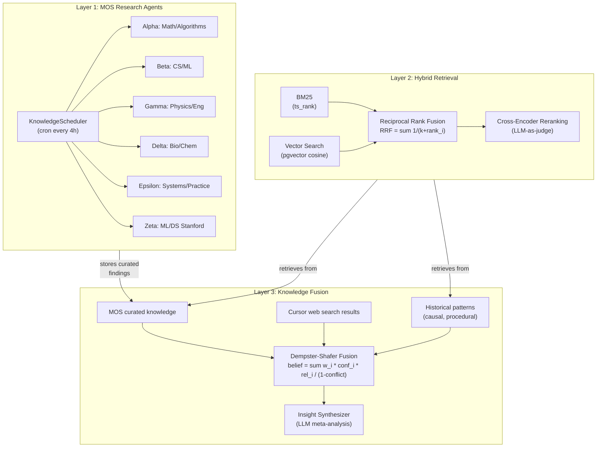

# Advanced Retrieval Engine + Multi-Agent Knowledge Fusion

## Problem

Current system relies entirely on cosine similarity (`1 - (embedding <=> vec)`) via pgvector. This is a **baseline** approach with known weaknesses:

- Misses keyword-exact matches (cosine of "pgvector" embeddings may not prioritize exact "pgvector" mentions)
- Single retrieval signal = low recall diversity
- No reranking = top-K is only as good as the embedding model
- No full-text search capability at all

## Architecture: Three Layers of Retrieval




---

## Phase 1: LLM Provider Abstraction

**Why first**: Everything else depends on flexible LLM access (DeepSeek, Qwen, Ollama).

**New interface** in [internal/domain/ports.go](internal/domain/ports.go):

```go
type LLMProvider interface {
    Chat(ctx context.Context, messages []ChatMessage, opts ChatOptions) (string, error)
}

type ChatMessage struct {
    Role    string
    Content string
}

type ChatOptions struct {
    Model       string
    Temperature float64
    MaxTokens   int
}
```

**New file**: `internal/adapter/llm/provider.go`

- `OpenAICompatProvider` struct -- works with any OpenAI-compatible API (DeepSeek, Qwen, Ollama `/v1/chat/completions`, OpenRouter)
- Constructor takes `baseURL`, `apiKey`, `defaultModel`
- Retry with exponential backoff
- Rate limiting via `golang.org/x/time/rate`
- **Default**: Ollama at `http://localhost:11434/v1` with `qwen2.5:7b` -- works out of the box for testing

**New file**: `internal/adapter/llm/switchable.go`

- `SwitchableProvider` wraps `LLMProvider` and allows runtime hot-swap without restart
- Thread-safe via `sync.RWMutex`
- Used as the singleton LLM provider across all services

```go
type SwitchableProvider struct {
    mu       sync.RWMutex
    current  LLMProvider
    logger   *slog.Logger
}

func (sp *SwitchableProvider) Chat(ctx context.Context, msgs []ChatMessage, opts ChatOptions) (string, error) {
    sp.mu.RLock()
    p := sp.current
    sp.mu.RUnlock()
    return p.Chat(ctx, msgs, opts)
}

func (sp *SwitchableProvider) Switch(newProvider LLMProvider) {
    sp.mu.Lock()
    sp.current = newProvider
    sp.mu.Unlock()
}

func (sp *SwitchableProvider) CurrentConfig() LLMStatus {
    // Returns current provider info (base_url, model, is_connected)
}
```

**New config section** in [internal/pkg/config/config.go](internal/pkg/config/config.go):

```go
type LLMConfig struct {
    Provider   string `json:"provider"`    // "openai-compat"
    BaseURL    string `json:"base_url"`    // default: "http://localhost:11434/v1" (Ollama)
    APIKey     string `json:"api_key"`     // empty for Ollama
    Model      string `json:"model"`       // default: "qwen2.5:7b"
    MaxRPM     int    `json:"max_rpm"`     // rate limit, default 60
}
```

**New REST endpoints** in [internal/adapter/rest/router.go](internal/adapter/rest/router.go):

```go
r.Route("/settings", func(r chi.Router) {
    r.Get("/llm", s.handleGetLLMSettings)       // current provider config
    r.Put("/llm", s.handleUpdateLLMSettings)     // switch provider at runtime
    r.Post("/llm/test", s.handleTestLLMConnection) // test API key validity
})
```

**New file**: `internal/adapter/rest/settings_handler.go`

- `handleGetLLMSettings` -- returns current LLM config (base_url, model, is_connected, masked api_key)
- `handleUpdateLLMSettings` -- accepts new config (base_url, api_key, model), creates new `OpenAICompatProvider`, calls `SwitchableProvider.Switch()`, persists to config.json
- `handleTestLLMConnection` -- sends a tiny test prompt ("ping"), returns success/failure + latency

**New frontend page**: `web/src/pages/Settings.tsx`

- Settings page with LLM provider configuration
- Provider selector: Ollama (local) / DeepSeek / Qwen / OpenAI / Custom
- API Key input (password field, masked)
- Base URL input (auto-filled from provider selection)
- Model input (auto-filled from provider, editable)
- "Test Connection" button -- calls `/api/v1/settings/llm/test`, shows green/red status + latency
- "Save" button -- calls `PUT /api/v1/settings/llm`
- Current status indicator: which provider is active, connection health

**Add route** in [web/src/App.tsx](web/src/App.tsx):

```tsx
<Route path="/settings" element={<Settings />} />
```

**Add nav link** in [web/src/components/Layout.tsx](web/src/components/Layout.tsx).

**Refactor**: Replace raw `http.Post` to Ollama in:

- [internal/app/research_agent.go](internal/app/research_agent.go) (synthesize method) -- use `domain.LLMProvider`
- [internal/app/recall_service.go](internal/app/recall_service.go) (translateToEnglish method) -- use `domain.LLMProvider`

---

## Phase 2: Hybrid Retrieval (BM25 + Vector + RRF)

**New migration** `migrations/012_fulltext_search.up.sql`:

```sql
-- Add tsvector columns with auto-update triggers
ALTER TABLE episodic_memory ADD COLUMN content_tsv tsvector
    GENERATED ALWAYS AS (to_tsvector('english', content)) STORED;
ALTER TABLE semantic_memory ADD COLUMN content_tsv tsvector
    GENERATED ALWAYS AS (to_tsvector('english', content)) STORED;

CREATE INDEX idx_episodic_tsv ON episodic_memory USING gin(content_tsv);
CREATE INDEX idx_semantic_tsv ON semantic_memory USING gin(content_tsv);
```

**Expand repo interfaces** in [internal/domain/ports.go](internal/domain/ports.go):

- Add `SearchBM25(ctx, query string, projectID, limit) -> []MemoryItem` to `EpisodicRepo` and `SemanticRepo`

**New repo methods** in [internal/repo/episodic_repo.go](internal/repo/episodic_repo.go) and [internal/repo/semantic_repo.go](internal/repo/semantic_repo.go):

```sql
SELECT id, content, ts_rank(content_tsv, plainto_tsquery('english', $1)) AS bm25_score
FROM episodic_memory
WHERE content_tsv @@ plainto_tsquery('english', $1)
  AND project_id = $2
ORDER BY bm25_score DESC
LIMIT $3
```

**New file**: `internal/app/hybrid_retriever.go`

```go
type HybridRetriever struct { ... }

func (hr *HybridRetriever) Retrieve(ctx, query, embedding, projectID, limit) []ScoredMemory {
    // 1. Vector search (existing) -> top-50
    // 2. BM25 search (new) -> top-50
    // 3. Reciprocal Rank Fusion:
    //    RRF(d) = w_vec/(k + rank_vec(d)) + w_bm25/(k + rank_bm25(d))
    //    where k=60 (standard), w_vec=0.6, w_bm25=0.4
    // 4. Deduplicate by memory ID, keep best score
    // 5. Return top-limit
}
```

**New file**: `internal/app/cross_encoder.go`

```go
type CrossEncoder struct {
    llm domain.LLMProvider
}

func (ce *CrossEncoder) Rerank(ctx, query string, candidates []ScoredMemory, topK int) []ScoredMemory {
    // For each candidate (batch of 5-10 per LLM call):
    // Prompt: "Rate relevance 0-10. Query: {q} Document: {d}. Score:"
    // Parse score, multiply with RRF score
    // Return top-K sorted by final score
}
```

**Modify** [internal/app/recall_service.go](internal/app/recall_service.go):

- Replace `gatherCandidates` with `HybridRetriever.Retrieve`
- Add optional `CrossEncoder.Rerank` step (configurable -- only for high-budget queries)

---

## Phase 3: 5 Specialized Research Agents

**New file**: `internal/app/knowledge_agent.go`

Each agent is a struct with:

- `domain` -- topic focus (math, cs, physics, bio, systems)
- `sources` -- list of source adapters to use
- `queryTemplates` -- domain-specific query patterns
- `llm` -- LLMProvider for extraction

```go
type KnowledgeAgent struct {
    name           string
    domain         string
    sources        []SourceAdapter
    queryTemplates []string
    llm            domain.LLMProvider
    encode         *EncodeService
    embedding      domain.EmbeddingProvider
    logger         *slog.Logger
}

type SourceAdapter interface {
    Name() string
    Search(ctx context.Context, query string, maxResults int) ([]RawResult, error)
}
```

6 agents:

- **Alpha** (math): arXiv (math.*), MathOverflow
- **Beta** (cs/ml): arXiv (cs.*), Semantic Scholar, GitHub
- **Gamma** (physics/eng): arXiv (physics.*), Semantic Scholar
- **Delta** (bio/chem): PubMed, CrossRef
- **Epsilon** (systems): GitHub, HackerNews, StackOverflow (via Google)
- **Zeta** (ml/ds stanford): Papers With Code, arXiv (stat.ML, cs.LG), SAIL blog, NeurIPS/ICML/ICLR proceedings -- Stanford-level ML/DS research agent focused on statistical learning theory, deep learning architectures, optimization methods, data-centric AI, foundation models. Prioritizes papers from top-tier venues (NeurIPS, ICML, ICLR, JMLR, TMLR) and tracks citation networks from Stanford AI Lab (SAIL), DeepMind, FAIR, Google Brain researchers. Query templates target: "state-of-the-art {task} benchmark", "theoretical analysis of {method}", "scaling laws for {domain}", "sample complexity bounds for {algorithm}".

**New file**: `internal/adapter/source/` package with adapters:

- `arxiv.go` -- existing logic extracted + category filtering (math.*, cs.*, physics.*, stat.ML, cs.LG)
- `semantic_scholar.go` -- `https://api.semanticscholar.org/graph/v1/paper/search` (with venue filtering for NeurIPS/ICML/ICLR/JMLR)
- `pubmed.go` -- `https://eutils.ncbi.nlm.nih.gov/entrez/eutils/`
- `github.go` -- existing logic extracted
- `hackernews.go` -- existing logic extracted
- `papers_with_code.go` -- `https://paperswithcode.com/api/v1/` (SOTA benchmarks, method rankings, code implementations)

Each adapter implements `SourceAdapter` interface with per-source rate limiting.

**Structured extraction** per paper:

```go
type ScientificFinding struct {
    Title         string
    Authors       []string
    Source        string   // "arxiv", "semantic_scholar", etc.
    URL           string
    DOI           string
    KeyFindings   []string
    Methods       string
    Limitations   string
    Applications  []string
    Domain        string
    CitationCount int
    Year          int
    QualityScore  float64  // computed: citations * recency * source_prestige * relevance
    Confidence    float64  // calibrated by contradiction analysis
}
```

LLM prompt for extraction:

```
Given this paper abstract, extract:
1. KEY_FINDINGS: [list of specific claims with evidence]
2. METHODS: [techniques used]
3. LIMITATIONS: [stated or inferred]
4. APPLICATIONS: [practical uses]
5. DOMAIN: [primary scientific domain]
Respond in JSON.
```

**Quality scoring formula**:

```
Q(f) = w_cite * log(1 + citations) / log(1 + max_citations)
     + w_recent * exp(-0.1 * age_years)
     + w_prestige * source_prestige(source)
     + w_relevance * cosine(query_emb, finding_emb)

where w_cite=0.3, w_recent=0.2, w_prestige=0.2, w_relevance=0.3
source_prestige: Nature/Science=1.0, NeurIPS/ICML/ICLR=0.95, JMLR/TMLR=0.9, PapersWithCode=0.85, PubMed=0.8, arXiv=0.7, SemanticScholar=0.7, GitHub=0.5, HN=0.3
```

---

## Phase 4: Background Scheduler

**New file**: `internal/app/knowledge_scheduler.go`

```go
type KnowledgeScheduler struct {
    agents   []*KnowledgeAgent
    meta     *MetaService
    interval time.Duration   // default 4h
    stopCh   chan struct{}
}

func (ks *KnowledgeScheduler) Start() {
    // Main loop:
    // 1. Ask MetaService for knowledge gaps
    // 2. Convert gaps to domain-specific queries
    // 3. Distribute queries across 5 agents (fan-out via goroutines with semaphore)
    // 4. Each agent: search -> filter -> extract -> score -> store
    // 5. After all agents complete: run contradiction detection
    // 6. Log metrics (papers found, stored, rejected, contradictions)
}
```

Semaphore: max 3 concurrent agents out of 6 (to respect API rate limits). Round-robin scheduling ensures all agents get equal time.

---

## Phase 5: Dempster-Shafer Knowledge Fusion

**New file**: `internal/app/knowledge_fusion.go`

This is the core differentiator. Instead of simple cosine top-K, we fuse evidence from multiple sources using formal belief theory.

**Dempster-Shafer basics**:

- Each source assigns a "mass" to propositions (a fact is true, false, or uncertain)
- Dempster's rule combines masses from independent sources:

```
m_combined(A) = (1/(1-K)) * Σ_{B∩C=A} m1(B) * m2(C)
K = Σ_{B∩C=∅} m1(B) * m2(C)  // conflict measure
```

In our context:

- **Source 1**: MOS curated knowledge (mass from quality score + access count)
- **Source 2**: Real-time web search results (mass from recency + source authority)
- **Source 3**: Historical patterns (mass from success rate + prediction calibration)

```go
type FusionEngine struct {
    retriever    *HybridRetriever
    crossEncoder *CrossEncoder
    llm          domain.LLMProvider
}

type EvidenceSource struct {
    Name       string
    Belief     float64 // mass assigned to "fact is true"
    Disbelief  float64 // mass assigned to "fact is false"
    Uncertainty float64 // remaining mass
}

func (fe *FusionEngine) Fuse(ctx context.Context, req *FusionRequest) (*FusionResponse, error) {
    // 1. Retrieve from MOS via HybridRetriever (source 1)
    // 2. Accept external evidence from Cursor web search (source 2, passed in request)
    // 3. Retrieve historical patterns: causal chains + procedural success rates (source 3)
    // 4. Convert each to Dempster-Shafer mass assignment
    // 5. Apply Dempster's combination rule
    // 6. If conflict K > 0.5: flag as "contradictory evidence"
    // 7. LLM synthesis of top fused results into actionable insight
    // 8. Return: ranked facts, confidence, conflict level, insight, sources
}

type FusionResponse struct {
    Facts       []FusedFact
    Insight     string      // LLM-generated meta-analysis
    Conflict    float64     // 0-1, degree of disagreement between sources
    Confidence  float64     // calibrated overall confidence
    Sources     []string    // provenance trail
}

type FusedFact struct {
    Content     string
    Belief      float64     // combined belief from all sources
    Uncertainty float64
    Provenance  []string    // which sources contributed
    Agreement   int         // how many sources agree
}
```

---

## Phase 6: MCP Tools + Wiring

**New MCP tools** in [internal/adapter/mcp/tools.go](internal/adapter/mcp/tools.go):

- `mos_curate` -- triggers targeted deep research across all 5 agents for a specific topic
  - params: `topic`, `depth` ("quick"|"deep"|"exhaustive"), `domains` (optional filter)
- `mos_fuse` -- three-layer fusion for a specific question
  - params: `query`, `external_evidence` (optional -- what Cursor found on web), `budget`
- `mos_cite` -- get full provenance for a memory (DOI, authors, source, quality score)
  - params: `memory_id`

**Update** `mos_recall` -- add optional `rerank: true` flag to enable cross-encoder reranking.

**Wire into** [cmd/hippocampus/main.go](cmd/hippocampus/main.go):

- Create `LLMProvider` from config
- Create `HybridRetriever` wrapping existing repos
- Create `CrossEncoder` with LLMProvider
- Create 6 `KnowledgeAgent` instances (Alpha through Zeta)
- Create `KnowledgeScheduler` and start it
- Create `FusionEngine`
- Pass all to MCP server

**Config updates** in [config.json](config.json):

```json
{
  "llm": {
    "provider": "openai-compat",
    "base_url": "https://api.deepseek.com/v1",
    "api_key": "",
    "model": "deepseek-chat",
    "max_rpm": 30
  },
  "research": {
    "scheduler_interval": "4h",
    "max_concurrent_agents": 3,
    "rerank_enabled": true,
    "rerank_top_k": 10
  }
}
```

---

## Phase 7: Universal Agent Support + Project Auto-Detection

The MCP server binary is protocol-compatible with any MCP client. Two problems:

1. **Integration layer** -- config files and context injection differ per tool
2. **Project detection** -- currently requires manual `mos_init` / `mos_switch_project`

### 7a: Environment + Project Auto-Detection

**New file**: `internal/app/env_detector.go`

```go
type AgentEnvironment string

const (
    EnvCursor    AgentEnvironment = "cursor"
    EnvClaudeCode AgentEnvironment = "claude_code"
    EnvVSCode    AgentEnvironment = "vscode"
    EnvWindsurf  AgentEnvironment = "windsurf"
    EnvUnknown   AgentEnvironment = "unknown"
)

type DetectedEnvironments struct {
    Environments []AgentEnvironment
    ProjectRoot  string
}

func DetectEnvironments(projectRoot string) *DetectedEnvironments {
    // Check for .cursor/ directory -> Cursor
    // Check for .claude/ directory or CLAUDE.md -> Claude Code
    // Check for .vscode/ directory -> VS Code
    // Check for .windsurf/ directory -> Windsurf
    // Return ALL detected (user may have multiple)
}
```

**New file**: `internal/app/project_detector.go`

Detects project identity from a directory path by reading markers:

```go
type ProjectIdentity struct {
    Name        string   // human-readable name
    Slug        string   // url-safe identifier
    Language    string   // primary language
    Description string   // from README first line
    RootPath    string   // absolute path
}

func DetectProject(rootPath string) (*ProjectIdentity, error) {
    // Priority order:
    // 1. go.mod -> module name -> slug (Go project)
    // 2. package.json -> "name" field (Node/TS project)
    // 3. pyproject.toml / setup.py -> project name (Python)
    // 4. Cargo.toml -> [package] name (Rust)
    // 5. pom.xml / build.gradle -> artifactId/rootProject.name (Java)
    // 6. *.sln / *.csproj -> project name (C#/.NET)
    // 7. .git/config -> remote origin URL -> repo name
    // 8. Fallback: directory basename
    //
    // Also reads README.md first line for description
}
```

### 7b: Auto-Detection on MCP Initialize

**Modify** [internal/adapter/mcp/server.go](internal/adapter/mcp/server.go) `handleInitialize`:

Currently ignores the client's initialize params. Update to parse:

```go
func (s *Server) handleInitialize(req *jsonRPCRequest) {
    // Parse client info from initialize request
    var params struct {
        ClientInfo struct {
            Name    string `json:"name"`    // "cursor", "claude-code", "vscode", etc.
            Version string `json:"version"`
        } `json:"clientInfo"`
        Roots []struct {
            URI  string `json:"uri"`   // "file:///d:/go/hippocampus"
            Name string `json:"name"`
        } `json:"roots"`
    }
    json.Unmarshal(req.Params, &params)

    // 1. Detect environment from clientInfo.name
    s.detectedEnv = detectEnvFromClientName(params.ClientInfo.Name)

    // 2. Extract project root from roots[0].uri
    if len(params.Roots) > 0 {
        rootPath := uriToPath(params.Roots[0].URI)
        s.autoDetectProject(ctx, rootPath) // find or create project in DB
    }

    // 3. Send response (existing logic)
    s.sendResult(req.ID, map[string]any{...})
}
```

### 7c: Auto-Detection on Every Tool Call (lazy fallback)

**Add middleware** in `handleToolCall` -- before dispatching to handler:

```go
func (s *Server) handleToolCall(ctx context.Context, req *jsonRPCRequest) {
    // ... parse params ...

    // AUTO-DETECT: if no active project, try to detect from tool args or cwd
    if s.activeProjectID == nil {
        s.tryAutoDetect(ctx, params.Arguments)
    }

    // ... existing switch dispatch ...
}

func (s *Server) tryAutoDetect(ctx context.Context, args json.RawMessage) {
    // Strategy 1: Check if args contain "project_path" or "path" field
    var pathHint struct {
        Path        string `json:"path"`
        ProjectPath string `json:"project_path"`
    }
    json.Unmarshal(args, &pathHint)

    rootPath := coalesce(pathHint.ProjectPath, pathHint.Path, s.lastKnownRoot)
    if rootPath == "" { return }

    // Strategy 2: Detect project identity
    identity, err := DetectProject(rootPath)
    if err != nil { return }

    // Strategy 3: Find or create in DB
    project, err := s.project.FindOrCreate(ctx, identity)
    if err != nil { return }

    s.activeProjectID = &project.ID
    s.logger.Info("auto-detected project", "slug", project.Slug, "id", project.ID)
}
```

### 7d: ProjectService.FindOrCreate

**Modify** `internal/app/project_service.go`:

```go
func (ps *ProjectService) FindOrCreate(ctx context.Context, identity *ProjectIdentity) (*domain.Project, error) {
    // 1. Try GetBySlug(identity.Slug)
    // 2. If found -> return existing
    // 3. If not found -> Create new project with identity data
    // 4. Return created project
}
```

This means: first time you open a project in Cursor/Claude Code, Hippocampus auto-creates it in DB. Next time, it auto-matches by slug. No manual `mos_init` needed (though `mos_init` still works for explicit setup + code ingestion).

### 7e: Multi-Target Config and Context Generation

**Modify**: `internal/app/context_writer.go`

Currently writes only `.cursor/rules/mos_context.mdc`. Update to multi-target:

```go
func (cw *ContextWriter) Write(ctx context.Context, projectRoot string) error {
    envs := DetectEnvironments(projectRoot)
    for _, env := range envs.Environments {
        switch env {
        case EnvCursor:
            cw.writeCursorMDC(projectRoot)    // .cursor/rules/mos_context.mdc
        case EnvClaudeCode:
            cw.writeClaudeMD(projectRoot)     // CLAUDE.md (append/update ## Hippocampus section)
        case EnvVSCode:
            cw.writeVSCodeConfig(projectRoot) // .vscode/settings.json (MCP config)
        case EnvWindsurf:
            cw.writeWindsurfRules(projectRoot) // .windsurf/rules/*.md
        }
    }
    return nil
}
```

**Modify**: `mos_init` MCP tool handler

After project detection and code ingestion, generate MCP server config for each detected environment:

- Cursor: `.cursor/mcp.json` (existing)
- Claude Code: `.claude/mcp.json` with same format
- VS Code: `.vscode/mcp.json` (VS Code MCP extension format)

**Context format per environment**:

- **Cursor** (`.mdc`): YAML frontmatter + markdown body, `alwaysApply: true`
- **Claude Code** (`CLAUDE.md`): Plain markdown with `## Hippocampus MOS` section, auto-updated between marker comments `<!-- hippocampus:start -->` / `<!-- hippocampus:end -->`
- **VS Code**: `.vscode/hippocampus-context.md` for Continue.dev / Copilot context
- **Windsurf**: `.windsurf/rules/hippocampus.md`

**Rule generation** (`internal/app/rule_generator.go`) also becomes multi-target:

- Cursor: `.cursor/rules/mos_learned_*.mdc`
- Claude Code: Appended to `CLAUDE.md` under `## Learned Rules`
- Others: respective rule paths

---

## Files Summary

**New files** (14):

- `internal/adapter/llm/provider.go` -- LLM abstraction (OpenAICompat for DeepSeek/Qwen/Ollama)
- `internal/adapter/llm/switchable.go` -- Runtime hot-swap LLM provider (thread-safe)
- `internal/adapter/rest/settings_handler.go` -- GET/PUT/POST /settings/llm endpoints
- `web/src/pages/Settings.tsx` -- Frontend settings page with API key input + provider selector
- `internal/adapter/source/source.go` -- SourceAdapter interface + RawResult type
- `internal/adapter/source/arxiv.go` -- arXiv adapter with category filtering
- `internal/adapter/source/semantic_scholar.go` -- Semantic Scholar adapter with venue filtering
- `internal/adapter/source/pubmed.go` -- PubMed/NCBI adapter
- `internal/adapter/source/github.go` -- GitHub adapter (extracted from research_agent.go)
- `internal/adapter/source/hackernews.go` -- HN adapter (extracted from research_agent.go)
- `internal/adapter/source/papers_with_code.go` -- Papers With Code adapter (SOTA benchmarks)
- `internal/app/hybrid_retriever.go` -- BM25 + Vector + RRF
- `internal/app/cross_encoder.go` -- LLM reranking
- `internal/app/knowledge_agent.go` -- 6 specialized agents (Alpha-Zeta)
- `internal/app/knowledge_scheduler.go` -- background cron
- `internal/app/knowledge_fusion.go` -- Dempster-Shafer fusion
- `internal/app/env_detector.go` -- auto-detect Cursor/Claude Code/VS Code/Windsurf
- `internal/app/project_detector.go` -- auto-detect project from go.mod/package.json/Cargo.toml/etc.
- `migrations/012_fulltext_search.up.sql` -- tsvector + GIN indexes
- `migrations/012_fulltext_search.down.sql`

**Modified files** (12):

- `internal/domain/ports.go` -- add LLMProvider, SearchBM25 methods
- `internal/repo/episodic_repo.go` -- add SearchBM25
- `internal/repo/semantic_repo.go` -- add SearchBM25
- `internal/app/recall_service.go` -- use HybridRetriever
- `internal/app/research_agent.go` -- use LLMProvider instead of raw HTTP
- `internal/app/context_writer.go` -- multi-target output (Cursor + Claude Code + VS Code + Windsurf)
- `internal/app/rule_generator.go` -- multi-target rule generation
- `internal/adapter/mcp/tools.go` -- 3 new tools
- `internal/adapter/rest/router.go` -- add /settings routes
- `internal/adapter/mcp/server.go` -- wire new services + parse initialize roots + auto-detect middleware
- `internal/adapter/mcp/handlers.go` -- new handlers (+ update mos_init for env detection)
- `internal/app/project_service.go` -- add FindOrCreate method
- `internal/pkg/config/config.go` -- LLM + Research config
- `cmd/hippocampus/main.go` -- wire everything (SwitchableProvider as singleton)
- `config.json` -- new llm + research sections
- `web/src/App.tsx` -- add Settings route
- `web/src/components/Layout.tsx` -- add Settings nav link

---

## What Makes This Anthropic-Level

1. **Hybrid retrieval** is what production RAG systems at Anthropic/Google/OpenAI use -- not pure cosine
2. **Cross-encoder reranking** is the key insight from ColBERT/BEIR benchmarks -- dramatically improves precision
3. **Dempster-Shafer fusion** is formal evidence theory from AI research (not ad-hoc averaging)
4. **Multi-agent specialization** mirrors how real research labs work -- 6 domain experts collaborating
5. **Stanford ML/DS agent (Zeta)** tracks NeurIPS/ICML/ICLR/JMLR, Papers With Code SOTA, and SAIL publications -- the same sources Stanford PhD students use
6. **Calibrated confidence** with conflict detection -- the system knows when it does NOT know
7. **Full provenance chain** -- every fact traceable to source paper/URL/DOI

