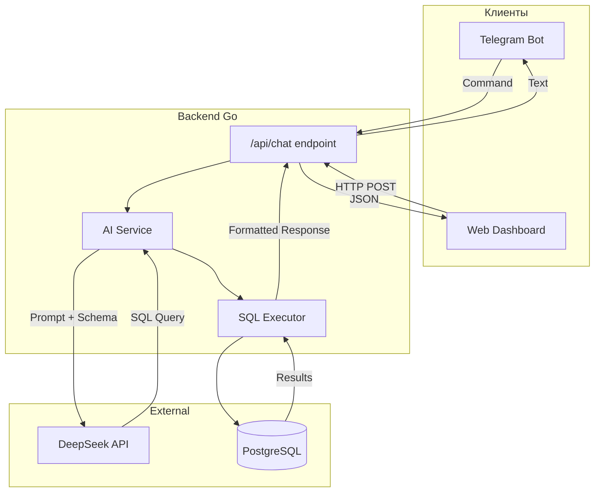

# AI Chat Integration Plan

## Архитектура



## Файловая структура

```
internal/
├── ai/
│   ├── chat_service.go      # AI сервис с LLM клиентом
│   ├── sql_executor.go      # Безопасное выполнение SQL
│   ├── prompt_builder.go    # Построение промптов со схемой
│   └── response_formatter.go # Форматирование ответов
├── service/
│   └── chat_handlers.go     # HTTP endpoint /api/chat
└── telegram/
    └── bot.go               # Добавить обработку AI сообщений
frontend/
└── app.js                   # Chat виджет
```

## Этап 1: AI Service (Backend)

### 1.1 Конфигурация

Добавить в [config.json](energo/config.json):

```json
"ai_config": {
  "enabled": true,
  "provider": "deepseek",
  "api_key": "sk-...",
  "base_url": "https://api.deepseek.com",
  "model": "deepseek-chat",
  "max_tokens": 2000,
  "temperature": 0.1
}
```

### 1.2 AI Service

Создать `internal/ai/chat_service.go`:

- OpenAI-совместимый клиент (работает с DeepSeek)
- System prompt с описанием схемы БД
- Парсинг SQL из ответа LLM
- Read-only SQL валидация (блокировка DELETE/DROP/UPDATE)

### 1.3 SQL Executor

Создать `internal/ai/sql_executor.go`:

- Выполнение только SELECT запросов
- Timeout для запросов (5 секунд)
- Лимит на количество строк (100)
- Форматирование результатов в JSON/текст

## Этап 2: HTTP API Endpoint

### 2.1 Chat Handler

Создать `internal/service/chat_handlers.go`:

```go
// POST /api/chat
type ChatRequest struct {
    Message string `json:"message"`
    Format  string `json:"format"` // "text" или "json"
}

type ChatResponse struct {
    Answer string      `json:"answer"`
    SQL    string      `json:"sql,omitempty"`
    Data   interface{} `json:"data,omitempty"`
    Error  string      `json:"error,omitempty"`
}
```

### 2.2 Регистрация endpoint

В [cmd/energy-monitor/main.go](energo/cmd/energy-monitor/main.go) добавить:

```go
api.POST("/chat", func(c *gin.Context) {
    energyService.HandleChat(c.Writer, c.Request)
})
```

## Этап 3: Telegram Integration

### 3.1 Обработка свободного текста

В [internal/telegram/bot.go](energo/internal/telegram/bot.go) модифицировать `pollUpdates()`:

- Сообщения без команды (не начинаются с `/`) отправлять в AI
- Добавить команду `/ask <вопрос>` как альтернативу

### 3.2 Форматирование для Telegram

- Markdown форматирование таблиц
- Разбиение длинных ответов на части (< 4096 символов)
- Экранирование спецсимволов

## Этап 4: Frontend Chat Widget

### 4.1 UI компонент

В [frontend/app.js](energo/frontend/app.js) добавить:

- Плавающая кнопка "AI Assistant" в правом нижнем углу
- Выдвижная панель чата
- История сообщений (localStorage)
- Индикатор загрузки

### 4.2 Примерный UI

```
┌─────────────────────────────┐
│ AI Assistant            [X] │
├─────────────────────────────┤
│ Вы: Какой ток на миксере?   │
│                             │
│ AI: Текущий ток на Миксере: │
│ - Фаза A: 32.6A             │
│ - Фаза B: 34.3A             │
│ - Фаза C: 32.0A             │
├─────────────────────────────┤
│ [Введите вопрос...]    [->] │
└─────────────────────────────┘
```

## Этап 5: System Prompt

Ключевой промпт для LLM:

```
Ты AI-ассистент для мониторинга энергопотребления завода.

БАЗА ДАННЫХ:
- me337_timeseries: time, device_uuid, i1/i2/i3 (токи А), u1/u2/u3 (напряжения В), pt (мощность кВт)
- rogovski_timeseries: time, device_uuid, phase1_amp/phase2_amp/phase3_amp (токи А)

УСТРОЙСТВА:
- UUID 1: Ввод ПЭТ-1 (Rogovski, 3000А)
- UUID 8-19: ПЭТ-2 (ME337)
- UUID 20-29: ПЭТ-1 анализаторы (ME337)

ПРАВИЛА:
1. Генерируй ТОЛЬКО SELECT запросы
2. Всегда добавляй LIMIT 100
3. Для последних данных: ORDER BY time DESC LIMIT 1
4. Используй time_bucket() для агрегации

Верни JSON: {"sql": "SELECT ...", "explanation": "..."}
```

## Безопасность

- Read-only пользователь PostgreSQL для AI запросов
- Whitelist разрешенных таблиц
- Timeout на выполнение (5 сек)
- Rate limiting (10 запросов/минута на пользователя)
- Логирование всех запросов