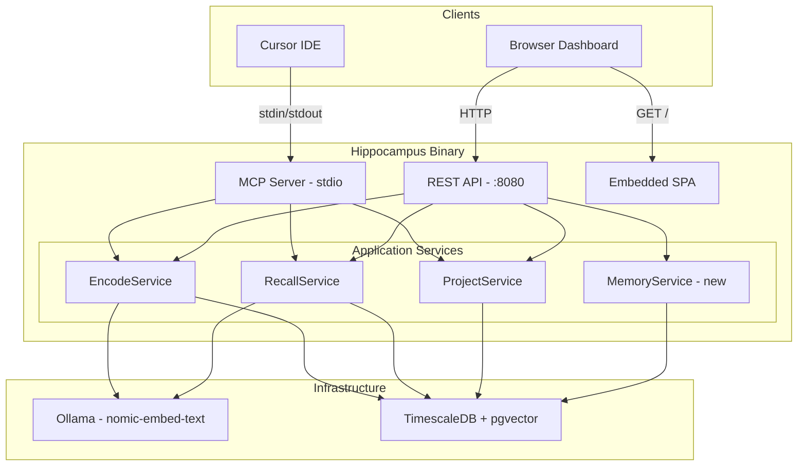

# Hippocampus: Cursor Integration + Full Dashboard

## Phase 1: Cursor MCP Connection (immediate)

Add `hippocampus` entry to `c:\Users\Shampoor\.cursor\mcp.json`:

```json
"hippocampus": {
  "command": "d:\\go\\hippocampus\\bin\\hippocampus.exe",
  "args": ["-config", "d:\\go\\hippocampus\\config.json", "-migrations", "d:\\go\\hippocampus\\migrations"]
}
```

---

## Phase 2: Go REST API (`internal/adapter/rest/`)

**Router**: `net/http` + `chi` (lightweight, idiomatic Go, zero magic)

All endpoints under `/api/v1/`, served on existing `:8080` port from config.

### Endpoints

**Memories:**

- `GET /api/v1/memories` -- paginated list, filters: `?project=slug&tier=episodic&tag=arch&q=search&page=1&limit=20`
- `POST /api/v1/memories` -- encode new memory (reuses EncodeService)
- `GET /api/v1/memories/:id` -- get by ID
- `DELETE /api/v1/memories/:id` -- delete memory
- `POST /api/v1/memories/recall` -- semantic recall (reuses RecallService)

**Projects:**

- `GET /api/v1/projects` -- list all projects with stats
- `POST /api/v1/projects` -- create project
- `GET /api/v1/projects/:slug` -- project detail
- `GET /api/v1/projects/:slug/stats` -- per-tier memory stats
- `DELETE /api/v1/projects/:slug` -- delete project

**System:**

- `GET /api/v1/stats` -- dashboard overview: total memories, by tier, embedding cache hits/misses, working memory fill
- `GET /api/v1/health` -- DB ping + Ollama ping

**New files:**

- `[internal/adapter/rest/router.go](internal/adapter/rest/router.go)` -- chi router, CORS, JSON middleware
- `[internal/adapter/rest/memory_handler.go](internal/adapter/rest/memory_handler.go)` -- memory CRUD + recall
- `[internal/adapter/rest/project_handler.go](internal/adapter/rest/project_handler.go)` -- project CRUD + stats
- `[internal/adapter/rest/system_handler.go](internal/adapter/rest/system_handler.go)` -- health, stats
- `[internal/adapter/rest/dto.go](internal/adapter/rest/dto.go)` -- request/response JSON DTOs

**New app-layer methods needed** (to support listing/deletion not yet in services):

- `MemoryService.List(ctx, filters)` -- queries EpisodicRepo directly with pagination
- `MemoryService.GetByID(ctx, id)`
- `MemoryService.Delete(ctx, id)`

**Modify `[cmd/hippocampus/main.go](cmd/hippocampus/main.go)`:** start HTTP server alongside MCP on `cfg.Server.RESTPort`

---

## Phase 3: React Dashboard (`web/`)

**Stack:**

- React 19 + Vite + TypeScript
- shadcn/ui + Tailwind CSS 4 (user already has shadcn MCP)
- Recharts -- charts for memory stats
- TanStack Query -- data fetching with caching
- TanStack Table -- sortable, filterable memory tables
- date-fns -- timestamp formatting

**Pages:**

1. **Dashboard** (`/`) -- overview cards (total memories, per-tier counts, cache hit rate, working memory fill %), recent memories list, project quick-switch
2. **Memory Explorer** (`/memories`) -- full table with sorting/filtering by tier, project, tags, importance; semantic search bar; click to expand full memory content; delete button
3. **Memory Detail** (`/memories/:id`) -- full content, metadata, embedding similarity visualization, emotional tags, timestamps
4. **Projects** (`/projects`) -- cards with per-project stats, create new project form, per-tier breakdown chart
5. **Recall Playground** (`/recall`) -- input query, see assembled context, inspect scoring/ranking, visualize which memories were selected and why
6. **Timeline** (`/timeline`) -- chronological view of memories as a vertical timeline, filterable by project

**Build integration**: `web/` builds to `web/dist/`, Go serves it via `embed.FS` at root `/` (SPA fallback). Single binary deployment.

**Project structure:**

```
web/
  src/
    components/    -- shadcn + custom components
    pages/         -- route pages
    api/           -- fetch wrapper + TanStack Query hooks
    lib/           -- utils
  index.html
  vite.config.ts
  package.json
  tailwind.config.ts
```

---

## Architecture Diagram




