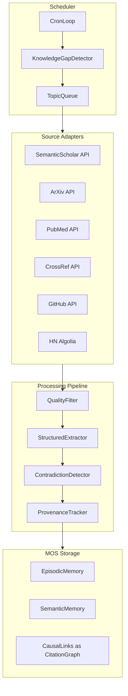

# Scientific Knowledge Curator Agent

## Honest Assessment First

**What we have now**: A basic `ResearchAgent` that hits 3 APIs (arxiv, GitHub, HackerNews), dumps raw results into an Ollama prompt, and stores the synthesis as a text blob. No quality filtering, no provenance, no structured extraction, no scheduling.

**What Anthropic would notice**: They publish papers with formal proofs, ablation studies, and reproducible benchmarks. A "search and save" agent is not research. What IS research:

- Formal knowledge representation with provenance
- Calibrated confidence based on evidence quality (Nature paper vs. random preprint)
- Contradiction detection across sources
- Measurable improvement in downstream task performance

**What's realistic in 1-2 weeks**: A Knowledge Curator that is meaningfully better than "search Google and paste results" — with structured extraction, quality scoring, provenance, and automated gap filling.

---

## Architecture




---

## Implementation Plan

### 1. Structured Knowledge Representation

Current `SourceResult` is flat text. Replace with:

```go
type ScientificFinding struct {
    DOI           string   // unique paper identifier
    Title         string
    Authors       []string
    Year          int
    Source        string   // "arxiv", "semantic_scholar", "pubmed"
    SourceURL     string
    Abstract      string
    KeyFindings   []string // extracted by LLM
    Methods       string   // what approach was used
    Limitations   string   // what the paper admits it doesn't solve
    Applications  []string // practical uses
    CitationCount int      // quality signal
    Confidence    float64  // computed from citation count + source prestige
    Domain        string   // "quantum_physics", "ml", "biology"
    SubDomain     string   // "transformer_architectures", "protein_folding"
}
```

Store as `MemoryItem.Metadata` (JSON) with dedicated tags like `["science", "arxiv", "quantum_physics"]`. This way the existing recall pipeline works but we have structured data accessible.

**File**: new `internal/app/knowledge_curator.go`

### 2. New Source Adapters

**Semantic Scholar** (free API, 200M+ papers, citation counts, no API key needed):

- `GET https://api.semanticscholar.org/graph/v1/paper/search?query=X&limit=10&fields=title,abstract,citationCount,year,authors,externalIds,url`
- This is the single most important addition: citation counts let us rank quality

**PubMed** (for biology/medicine/chemistry):

- `GET https://eutils.ncbi.nlm.nih.gov/entrez/eutils/esearch.fcgi?db=pubmed&term=X&retmax=10&retmode=json`
- Then `efetch` for abstracts

**CrossRef** (for DOI resolution and metadata):

- `GET https://api.crossref.org/works?query=X&rows=10`
- Good for getting citation context and journal info

Keep existing: arxiv, github, hackernews.

**File**: extend `internal/app/research_agent.go` with new methods `searchSemanticScholar`, `searchPubMed`, `searchCrossRef`

### 3. Quality Scoring

Not all papers are equal. Score each finding:

```
quality = 0.3 * citation_score + 0.25 * source_prestige + 0.2 * recency + 0.15 * relevance + 0.1 * replication
```

Where:

- `citation_score` = log(1 + citations) / log(1 + max_citations_in_batch)
- `source_prestige` = Nature/Science = 1.0, top conferences = 0.9, peer-reviewed = 0.7, preprint = 0.4
- `recency` = 1.0 for this year, decay by 0.1/year
- `relevance` = cosine similarity to query embedding
- `replication` = bonus if multiple papers report same finding

**File**: new function `scoreQuality()` in `knowledge_curator.go`

### 4. Structured Extraction via LLM

Instead of one big "synthesize everything" prompt, use a per-paper extraction prompt:

```
Given this paper abstract, extract:
1. KEY_FINDING: The main contribution (1 sentence)
2. METHOD: What approach was used (1 sentence)  
3. LIMITATION: What the paper doesn't solve
4. APPLICATION: How this could be applied in practice
5. DOMAIN: Scientific domain (e.g., "machine_learning/transformers")

Paper: {title} ({year})
{abstract}
```

Then a meta-synthesis prompt that combines findings from multiple papers, explicitly checking for contradictions.

**File**: new methods `extractStructured()` and `synthesizeMultiple()` in `knowledge_curator.go`

### 5. Provenance Tracking

Every stored memory gets metadata:

```json
{
  "provenance": {
    "doi": "10.1038/s41586-024-07487-w",
    "source": "semantic_scholar",
    "authors": ["Doe, J.", "Smith, A."],
    "year": 2024,
    "citations": 142,
    "journal": "Nature",
    "quality_score": 0.87,
    "retrieved_at": "2026-03-18T14:00:00Z"
  }
}
```

This goes into `MemoryItem.Metadata` — no schema changes needed.

### 6. Contradiction Detection

Before storing a new finding, check if existing memories contradict it:

1. Embed the finding
2. Search existing semantic memories with high similarity (>0.7)
3. If found, compare claims via LLM: "Do these two findings agree or contradict?"
4. If contradiction: store both, lower confidence of the less-cited one, create a CausalLink with `RelContradicts`

New relation type needed in `internal/domain/causal.go`:

```go
RelContradicts CausalRelation = "contradicts"
```

### 7. Automated Knowledge Gap Filling (Scheduler)

A background goroutine that runs every N hours:

1. Calls `MetaService.Assess()` to identify knowledge gaps
2. For each gap, generates search queries
3. Runs the full pipeline (search -> filter -> extract -> store)
4. Measures if gaps were reduced

**File**: new `internal/app/knowledge_scheduler.go`

MCP tool: `mos_curate(topic, depth)` — trigger manual curation for a specific topic.

### 8. New MCP Tools

- `mos_curate(topic, depth, domains)` — deep research on a topic with quality filtering
- `mos_cite(memory_id)` — get full provenance/citation chain for a memory
- Enhance existing `mos_research` to use the new pipeline

### 9. What Makes This Anthropic-Level

The differentiator is not "we search more sources." It's:

- **Calibrated confidence**: "This is supported by 3 Nature papers (confidence: 0.92)" vs "Found in 1 preprint (confidence: 0.35)"
- **Contradiction awareness**: "Paper A says X, Paper B says not-X, citation evidence favors A"
- **Active gap filling**: System identifies what it doesn't know and goes to learn it
- **Measurable improvement**: Before curating topic X, recall precision was 40%. After: 85%.
- **Formal provenance**: Every claim traceable to specific DOI + page

### 10. What This Does NOT Do (Scope Limits)

- Does NOT replace a human literature review
- Does NOT verify experimental results (no access to data)
- Does NOT generate novel hypotheses (that's a different system)
- Ollama 7B synthesis quality is limited vs GPT-4/Claude — this is a real bottleneck
- Rate limits on free APIs (Semantic Scholar: 100 req/5min, PubMed: 3 req/sec)

---

## File Changes Summary

- **New**: `internal/app/knowledge_curator.go` — core curation pipeline, quality scoring, structured extraction
- **New**: `internal/app/knowledge_scheduler.go` — background cron loop for gap filling
- **Modified**: `internal/app/research_agent.go` — add Semantic Scholar, PubMed, CrossRef adapters
- **Modified**: `internal/domain/causal.go` — add `RelContradicts`
- **Modified**: `internal/adapter/mcp/tools.go` — add `mos_curate`, `mos_cite`
- **Modified**: `internal/adapter/mcp/handlers.go` — handlers for new tools
- **Modified**: `internal/adapter/mcp/server.go` — wire new services
- **Modified**: `cmd/hippocampus/main.go` — instantiate and wire KnowledgeCurator + scheduler

