```mermaid
graph TD
    Agent["AI Agent (Claude/Cursor)"] -->|MCP stdio| MCP["adapter/mcp"]
    Browser["Browser"] -->|HTTP| REST["adapter/rest"]
    MCP --> App["app/ (services)"]
    REST --> App
    App --> Domain["domain/ (entities, interfaces)"]
    App --> Repo["repo/ (PostgreSQL)"]
    App --> Embedding["embedding/ (Ollama)"]
    App --> LLM["adapter/llm (Ollama)"]
    App --> Memory["memory/ (working memory)"]
    Repo --> DB[(TimescaleDB)]
```

# 🧠 Hippocampus MOS

> Autonomous learning layer for AI coding agents. The system remembers every mistake and teaches future sessions to avoid them.

[](https://go.dev)
[](https://modelcontextprotocol.io)
[](https://github.com/samj6178/hippocampus)
[](LICENSE)

---

## The Problem

AI coding agents repeat the same mistakes across sessions. Each conversation starts from zero — no memory of past errors, decisions, or hard-won context. A bug fixed today gets reintroduced tomorrow. Architectural decisions get re-debated. The same anti-patterns appear over and over.

## The Solution

Hippocampus MOS is an **immune system for AI agents**. It runs as a local MCP server that every agent session connects to:

```
error occurs
    │
    ▼
mos_learn_error ──► structured error + root cause stored
    │
    ▼
consolidation ──► similar errors clustered into prevention rules
    │
    ▼
rule injected ──► next session sees WARNING before touching that code
    │
    ▼
session ends ──► git diff analyzed to verify the warning worked
```

Rules are written into `.cursor/rules/` and `.claude/` as `.mdc` files — live context for every future agent working on the same project.

---

## Quick Start

### Prerequisites

- **Go 1.22+** — [install](https://go.dev/dl/)
- **Docker** — for TimescaleDB ([install](https://docs.docker.com/get-docker/))
- **Ollama** — local LLM runtime ([install](https://ollama.ai))

### Step 1 — Install Ollama (embeddings only)

Hippocampus needs Ollama only for text embeddings (274MB model). The LLM for rule generation is **optional** — your AI agent (Claude, GPT-4, Gemini) handles it automatically via two-phase delegation.

```bash
# Install Ollama
curl -fsSL https://ollama.ai/install.sh | sh   # Linux/macOS
# Windows: https://ollama.ai/download

# Start Ollama and pull the embedding model
ollama serve
ollama pull nomic-embed-text    # 274MB — this is all you need
```

**Optional: local LLM for background tasks**

If you want hippocampus to generate rules autonomously (without an agent connected), install a local LLM:

```bash
ollama pull qwen2.5:7b          # 4.7GB, good default
# Or use the web dashboard to connect DeepSeek, OpenRouter, etc.
```

| Mode | LLM Source | Setup |
|------|-----------|-------|
| **Claude Code** | Opus/Sonnet (automatic) | `"provider": "none"` in config |
| **Cursor** | Your selected model (automatic) | `"provider": "none"` in config |
| **Background** | Local Ollama or cloud API | Configure via web dashboard |

### Step 2 — Start the database

```bash
# Using Docker Compose (recommended)
docker compose up -d timescaledb

# Or manually
docker run -d --name hippocampus-db \
  -e POSTGRES_USER=mos \
  -e POSTGRES_PASSWORD=mos \
  -e POSTGRES_DB=hippocampus \
  -p 5432:5432 \
  timescale/timescaledb:latest-pg16
```

### Step 3 — Build and configure

```bash
git clone https://github.com/samj6178/hippocampus.git
cd hippocampus

# Build the binary
go build -o bin/hippocampus ./cmd/hippocampus/

# Copy and edit config
cp config.example.json config.json
# Edit config.json — set database credentials, model preferences
```

### Step 4 — Run

```bash
# Run directly (MCP stdio mode — for agent integration)
./bin/hippocampus -config config.json -migrations migrations/

# Or run with REST API for the web dashboard
./bin/hippocampus -config config.json -migrations migrations/
# Dashboard: http://localhost:8080
# Health: http://localhost:8080/api/v1/health/ready
```

### Configuration

```json
{
  "server": {
    "rest_port": 8080
  },
  "database": {
    "host": "localhost",
    "port": 5432,
    "db_name": "hippocampus",
    "user": "mos",
    "password": "mos"
  },
  "embedding": {
    "base_url": "http://localhost:11434/v1",
    "model": "nomic-embed-text",
    "dimensions": 768
  },
  "llm": {
    "provider": "none"
  },
  "memory": {
    "consolidation_interval": "6h",
    "embedding_cache_size": 10000
  }
}
```

`"provider": "none"` means the agent handles all LLM tasks via two-phase delegation — no local model required. For background processing (timer-based consolidation, scheduled tasks without an agent), use the web dashboard at `http://localhost:8080` to connect any OpenAI-compatible API.

### MCP Integration

**Claude Code** — add to `~/.claude/claude_desktop_config.json`:

```json
{
  "mcpServers": {
    "hippocampus": {
      "command": "/path/to/hippocampus/bin/hippocampus",
      "args": ["-config", "/path/to/hippocampus/config.json",
               "-migrations", "/path/to/hippocampus/migrations"]
    }
  }
}
```

**Cursor** — add to `.cursor/mcp.json`:

```json
{
  "mcpServers": {
    "hippocampus": {
      "command": "./bin/hippocampus",
      "args": ["-config", "./config.json", "-migrations", "./migrations"]
    }
  }
}
```

### Full Automation (recommended)

Hippocampus can run fully automatically using Claude Code hooks. Add this to your **global** `~/.claude/settings.json`:

```json
{
  "hooks": {
    "SessionStart": [
      {
        "hooks": [{
          "type": "command",
          "command": "echo '{\"hookSpecificOutput\":{\"hookEventName\":\"SessionStart\",\"additionalContext\":\"HIPPOCAMPUS AUTO: Call mos_init with the current workspace path NOW. This is the first action of every session. Do not skip.\"}}'",
          "statusMessage": "Hippocampus: session init"
        }]
      }
    ],
    "PostToolUseFailure": [
      {
        "hooks": [{
          "type": "command",
          "command": "echo '{\"hookSpecificOutput\":{\"hookEventName\":\"PostToolUseFailure\",\"additionalContext\":\"HIPPOCAMPUS AUTO: A tool just failed. Call mos_learn_error with the error message, root cause, and fix. Do not skip error capture.\"}}'",
          "statusMessage": "Hippocampus: error detected"
        }]
      }
    ],
    "Stop": [
      {
        "hooks": [{
          "type": "command",
          "command": "echo '{\"hookSpecificOutput\":{\"hookEventName\":\"Stop\",\"additionalContext\":\"HIPPOCAMPUS AUTO: Session ending. If mos_session_end was not called yet, call it now with a summary of what was done.\"}}'",
          "statusMessage": "Hippocampus: session end check"
        }]
      }
    ]
  }
}
```

This gives you:

| Hook | When | What happens |
|------|------|-------------|
| **SessionStart** | Every new conversation | Agent auto-calls `mos_init`, loads full context |
| **PostToolUseFailure** | Any tool error | Agent auto-calls `mos_learn_error`, captures bug |
| **Stop** | Session ending | Agent auto-calls `mos_session_end`, saves summary |

Also add to your **global** `~/.claude/CLAUDE.md`:

```markdown
## Hippocampus MOS (MANDATORY)

- Call mos_init at the start of every session with the workspace path
- Call mos_learn_error on ANY error (compilation, test failure, runtime error)
- Call mos_recall before starting any significant task
- Call mos_file_context before editing important files
- Call mos_session_end with a summary when finishing
- When mos_consolidate returns pending_tasks, process the prompts and call mos_consolidate_complete
```

**For Cursor users** — add the same instructions to `.cursorrules` in your project root.

---

## Architecture

Clean architecture — dependencies flow inward, domain has zero external imports.

```
cmd/hippocampus/        entry point, DI wiring, config loading
internal/
  domain/               entities, interfaces, sentinel errors (no deps)
  app/                  33 business logic services
  adapter/
    mcp/                MCP stdio server — 33 tools
    rest/               REST API + web UI (chi router)
    llm/                Ollama LLM provider (switchable)
    grpc/               gRPC adapter
  embedding/            nomic-embed-text via Ollama OpenAI API
  repo/                 PostgreSQL/TimescaleDB repositories (pgx/v5)
  memory/               In-memory working memory (sync.RWMutex)
  metrics/              Prometheus counters and histograms
  pkg/                  Leaf utilities (vecutil, etc.)
migrations/             12 versioned .up.sql / .down.sql pairs
web/                    React + TypeScript + Tailwind dashboard
monitoring/             Prometheus + Grafana configuration
```



---

## Bug Prevention Pipeline

This is the core feature. The pipeline converts raw errors into structured warnings that prevent future agents from making the same mistakes.

### Step 1 — Capture

When an error occurs, the agent calls `mos_learn_error`:

```
Error: goroutine leak — http.Client without timeout causes goroutine to hang
Root cause: copied pattern from old code, Timeout field not set
Fix: &http.Client{Timeout: 30 * time.Second}
Prevention: always set Timeout; never use http.DefaultClient in services
File: internal/adapter/rest/client.go
```

### Step 2 — Consolidation

After enough similar errors accumulate, `mos_consolidate` clusters them and generates a structured prevention rule (WHEN/WATCH/BECAUSE/DO/ANTIPATTERN format):

```
WHEN: creating http.Client in Go
WATCH: &http.Client{} with no Timeout field set
BECAUSE: a client with no timeout blocks the goroutine indefinitely on
         slow or hung remote servers, leaking the goroutine until restart
DO: always set Timeout: 30*time.Second; never use http.DefaultClient
ANTIPATTERN: &http\.Client\{\s*\}
```

### Step 3 — Injection

Rules are written to:
- `.cursor/rules/mos_learned_<topic>.mdc` — loaded automatically by Cursor
- `.claude/mos_learned_<topic>.mdc` — loaded by Claude Code

When any agent opens `internal/adapter/rest/client.go`, they see the warning before writing a single line.

### Step 4 — Verification

At session end, `mos_session_end` triggers `PreventionAnalyzer`:

- Runs `git diff <session-start-commit>`
- For each injected warning with an `ANTIPATTERN` regex, checks whether the anti-pattern appears in the added lines
- Reports: **Prevented** (warning shown, anti-pattern absent) vs **Ignored** (warning shown, anti-pattern present)

---

## Agent-Delegated LLM

Hippocampus delegates all LLM work to your agent — no local model needed for rule generation.

**How it works:**

1. Agent calls `mos_consolidate` → hippocampus clusters errors (CPU + embeddings)
2. Returns `pending_tasks` with prompts for the agent to process
3. Agent generates rules using its own LLM (Opus, Sonnet, GPT-4, Gemini)
4. Agent calls `mos_consolidate_complete` with results
5. Hippocampus stores high-quality rules

This means rules generated by Opus 4.6 (200B+ params) instead of a local 7B model — dramatically better anti-patterns, more specific WHEN/WATCH/DO instructions, and fewer false positives.

**Fallback:** For background processing (timer-based consolidation, scheduled tasks), configure any OpenAI-compatible API via the web dashboard or `mos_configure_llm`.

---

## Memory Tiers

Inspired by the neuroscience of human memory:

| Tier | Storage | Contents | Lifetime |
|------|---------|----------|----------|
| Working | In-memory (sync.Map) | Current session context, open files, recent events | Session |
| Episodic | PostgreSQL | Specific events, errors, decisions with timestamps | Permanent |
| Semantic | PostgreSQL + embeddings | Consolidated knowledge, prevention rules, facts | Permanent |
| Procedural | PostgreSQL | Step-by-step workflows learned from session outcomes | Permanent |

**Semantic memories** are stored with 768-dimensional embeddings (nomic-embed-text). Recall uses hybrid retrieval: cosine similarity + BM25 full-text search + LLM reranking (blend: 0.6 cosine + 0.4 LLM score).

**Prediction error encoding** — surprising outcomes are encoded stronger. When `mos_predict` is followed by `mos_resolve`, the prediction delta `δ = |predicted_confidence - actual|` determines importance: `importance = 0.5 × (1 + 1.5 × δ)`. High-surprise memories are encoded 2-3× stronger, mirroring hippocampal prediction error signals.

---

## MCP Tools Reference

33 tools organized by function:

### Session
| Tool | Description |
|------|-------------|
| `mos_init` | Initialize for workspace. Auto-detects project, creates if new. Call first. |
| `mos_session_end` | Summarize session, store as episodic memory, run prevention analysis. |

### Core Memory
| Tool | Description |
|------|-------------|
| `mos_remember` | Store a memory (fact, decision, pattern) with optional tags and importance. |
| `mos_recall` | Hybrid recall across all tiers. Returns assembled context within token budget. |
| `mos_learn_error` | Capture an error as a high-importance preventable pattern. |
| `mos_file_context` | Get memories relevant to a specific file before editing it. |
| `mos_feedback` | Mark a recalled memory as useful/not-useful (adjusts importance). |

### Learning
| Tool | Description |
|------|-------------|
| `mos_consolidate` | Cluster episodic memories → promote to semantic rules. |
| `mos_predict` | Register a prediction before an action (tracks calibration). |
| `mos_resolve` | Resolve prediction with actual outcome. Computes prediction error. |
| `mos_track_outcome` | Report success/failure of a followed procedure. |

### Projects
| Tool | Description |
|------|-------------|
| `mos_create_project` | Register a new project for memory namespacing. |
| `mos_list_projects` | List all projects with memory statistics. |
| `mos_switch_project` | Switch active project context, clear working memory. |
| `mos_study_project` | Deep-read project files (README, CLAUDE.md, docker-compose, etc.) into memory. |
| `mos_ingest_codebase` | Walk directory, extract functions/structs via AST, store as semantic memories. |

### Analysis
| Tool | Description |
|------|-------------|
| `mos_health` | Check embedding, DB, memory counts. Diagnose issues. |
| `mos_metrics` | Learning metrics: recall hit rate, errors learned, knowledge coverage. |
| `mos_evaluate` | Formal evaluation: recall precision, Brier calibration, learning curve. |
| `mos_benchmark` | Reproducible benchmark: 12 query scenarios, precision/recall/F1/MRR. |
| `mos_ab_test` | A/B test: warnings ON vs OFF across 12 coding scenarios. |
| `mos_meta` | Metacognition: memory distribution, calibration, knowledge gaps, recommendations. |

### Research
| Tool | Description |
|------|-------------|
| `mos_research` | Autonomous research agent: arXiv, GitHub, Hacker News → synthesized findings. |
| `mos_curate` | Deep research via 6 domain agents (math, CS/ML, physics, biology, systems, ML-DS). |
| `mos_fuse` | Combine MOS memory with external evidence using Dempster-Shafer theory. |
| `mos_analogize` | Find cross-project structural analogies (Structure Mapping Theory). |

### Utility
| Tool | Description |
|------|-------------|
| `mos_cite` | Get full provenance for a memory: DOI, authors, source, quality score. |

---

## A/B Test Results

`mos_ab_test` runs 12 coding scenarios across two conditions: warnings ON (treatment) vs warnings OFF (control). Each scenario has a known anti-pattern (regex) and a correct/buggy diff pair.

```
# A/B Test: Warning Prevention Effectiveness

## Warning Quality
| Metric    | Value |
|-----------|-------|
| Precision | 86%   |
| Recall    | 100%  |
| TP        | 12    |
| FP        | 2     |
| FN        | 0     |

## Prevention Effectiveness
| Condition               | Bugs | Clean | Rate  |
|------------------------|------|-------|-------|
| Treatment (warnings ON) | 0    | 12    | 100%  |
| Control (warnings OFF)  | 12   | 0     | 0%    |
| Lift                    |      |       | +100% |

## By Category
| Category        | Scenarios | TP | Prevented | Rate  |
|----------------|-----------|-----|-----------|-------|
| architecture    | 2         | 2   | 2         | 100%  |
| concurrency     | 2         | 2   | 2         | 100%  |
| error_handling  | 3         | 3   | 3         | 100%  |
| injection       | 1         | 1   | 1         | 100%  |
| protocol        | 1         | 1   | 1         | 100%  |
| resource_leak   | 3         | 2   | 2         | 67%   |
```

Scenarios covered: pgx pool leak, http.Client without timeout, SQL injection, goroutine without context, nil map access, hardcoded slice index, concurrent map race, error swallowing, file handle leak, import cycle, TimescaleDB aggregate-in-transaction, MCP Content-Length framing.

---

## Performance

| Operation | Latency |
|-----------|---------|
| Warning matching (in-memory) | < 1ms |
| Recall (local embedding) | < 50ms |
| Rule generation (local LLM) | ~5s |
| Full consolidation pass | ~30s / 100 memories |

Memory capacity tested with 1,400+ semantic memories. Embedding cache (configurable, default 10,000 entries) keeps repeat recall latency at sub-millisecond.

Concurrency is bounded by a semaphore on LLM and embedding calls to prevent goroutine explosion under load. Graceful shutdown drains in-flight work via `sync.WaitGroup` before closing the DB pool.

---

## Web Dashboard

A React + TypeScript + Tailwind UI is embedded in the binary (`make build` bundles it). Served at `http://localhost:8080`.

Features: memory browser, project switcher, recall search, consolidation trigger, LLM settings, Prometheus metrics link.

---

## Observability

- **Health**: `GET /api/v1/health/live`, `GET /api/v1/health/ready`
- **Metrics**: `GET /metrics` (Prometheus format) — LLM call counts, embedding latency, recall hit rate, prevention stats
- **Grafana dashboard**: included in `monitoring/grafana/dashboards/`

```bash
# Start full stack with monitoring
docker compose up -d
# Grafana: http://localhost:3001  (admin / hippocampus)
# Prometheus: http://localhost:9091
```

---

## Development

```bash
make test              # unit tests with -race
make test-integration  # integration tests (requires DB)
make test-coverage     # coverage report
make lint              # go vet
```

Database schema is managed via 12 versioned migration files in `migrations/`. Each has a `.up.sql` and `.down.sql`. TimescaleDB continuous aggregates use the `@notx` marker to run outside transactions.

---

## Contributing

1. Fork and create a feature branch
2. Keep changes focused — one concern per PR
3. Tests are mandatory — table-driven, include edge cases
4. Run `make test` with `-race` before submitting
5. Follow the clean architecture dependency rule: `adapter → app → domain`

---

## License

MIT — see [LICENSE](LICENSE).
